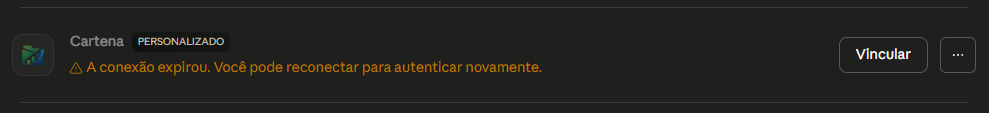
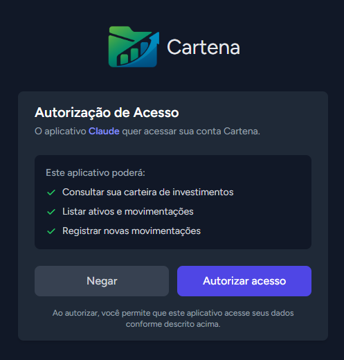
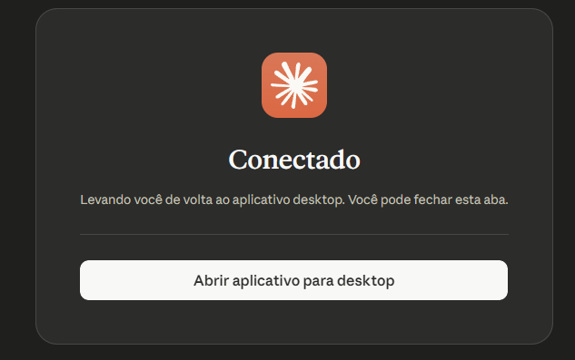
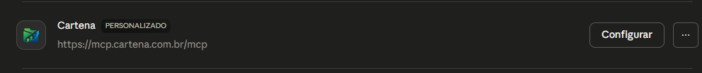

# 🚀 Cartena MCP Server

Este projeto implementa um servidor MCP (Model Context Protocol) que expõe ferramentas (tools) da Cartena para integração com clientes de IA compatíveis, como o Claude.

Suporta dois modos de uso:
- **Remoto via OAuth** ⭐ — sem instalação, recomendado para a maioria dos usuários
- **Local via stdio** — para desenvolvimento ou ambientes sem acesso à internet

---

# 📦 Instalação

## 1. MCP Remoto via OAuth ⭐ (recomendado)

A forma mais simples e recomendada de usar o Cartena MCP é através do servidor remoto, sem precisar instalar nada localmente. A autenticação é feita via **OAuth**, ou seja, você autoriza o acesso com sua conta Cartena diretamente pelo navegador.

**URL do servidor remoto:**
```
https://mcp.cartena.com.br/mcp
```

### Configurando no Claude.ai

**1. Cadastre o conector:**
1. Acesse [claude.ai](https://claude.ai) e abra as **Configurações**
2. Vá até a seção **Connectors** na barra lateral
3. Clique em **Add custom connector** e informe a URL:
   ```
   https://mcp.cartena.com.br/mcp
   ```
4. Confirme para salvar

**2. Vincule sua conta:**
1. Na lista de conectores, localize o **Cartena** e clique em **Vincular**

   

2. Uma janela será aberta solicitando a autorização
   > Gerencie seus acesss em: [Cartena → Segurança](https://cartena.com.br/security)

   

3. Clique em **Autorizar acesso**

4. A tela de **Conectado** confirma que a autenticação foi bem-sucedida — pode fechar a aba

   

5. O conector estará pronto para uso nas suas conversas

   

### Configurando via arquivo (clientes MCP compatíveis)

Para clientes que suportam MCP remoto com OAuth (como Claude Desktop nas versões mais recentes):

```json
{
  "mcpServers": {
    "cartena": {
      "url": "https://mcp.cartena.com.br/mcp"
    }
  }
}
```

> O cliente cuidará automaticamente do fluxo de autenticação OAuth na primeira conexão.

---

## 2. Uso via npx ❌ (NÃO recomendado)
OBS: sua credencial ficará exposta em um ambiente não seguro.

Para usar sem instalar, via `npx`:

```json
{
  "mcpServers": {
    "cartena": {
      "command": "npx",
      "args": [
        "-y",
        "github:cartena-tecnologia/cartena-mcp"
      ],
      "env": {
        "CARTENA_TOKEN": "SEU_TOKEN_AQUI"
      }
    }
  }
}
```

---

# 🔐 Variáveis de ambiente

> Necessário apenas para instalação local (npx ou node). No MCP remoto, a autenticação é feita via OAuth.

- `CARTENA_TOKEN`: Token de autenticação utilizado para acessar a API interna

Exemplo:

```bash
CARTENA_TOKEN=seu_token_aqui
```

---

# 🧠 Como funciona

O servidor MCP expõe ferramentas disponíveis (`tools/list`), recebe chamadas (`tools/call`) e encaminha as requisições para a API backend da Cartena. O fluxo varia conforme o modo de uso:

**Modo remoto:** o cliente de IA (ex: Claude) se conecta diretamente ao servidor hospedado em `https://mcp.cartena.com.br/mcp` via HTTPS. A autenticação é feita por OAuth, sem necessidade de instalação local.

**Modo local:** o servidor é iniciado como processo filho via stdio na máquina do usuário, e a autenticação é feita via `CARTENA_TOKEN` nas variáveis de ambiente.

---

# 🛠️ Estrutura das tools

Cada tool implementa:

- `name`: identificador da ferramenta  
- `description`: descrição para o modelo  
- `inputSchema`: schema JSON dos parâmetros  
- `handle()`: lógica de execução  

---

# ⚠️ Observações

- **Modo remoto:** certifique-se de que o token informado no fluxo OAuth é válido. Em caso de expiração, clique em **Vincular** novamente para reconectar
- **Modo local:** o servidor precisa ser executado como processo local (stdio) e o `CARTENA_TOKEN` deve estar configurado nas variáveis de ambiente
- Não é necessário expor endpoints HTTP no modo local

---

# 👩‍💻 Desenvolvimento

Para rodar o servidor localmente durante o desenvolvimento:

```bash
git clone https://github.com/cartena-tecnologia/cartena-mcp.git
cd cartena-mcp
npm install
node server.js
```

Configure o cliente MCP apontando para o arquivo local:

```json
{
  "mcpServers": {
    "cartena": {
      "command": "node",
      "args": ["C:/caminho/para/cartena-mcp/server.js"],
      "env": {
        "CARTENA_TOKEN": "SEU_TOKEN_AQUI"
      }
    }
  }
}
```
